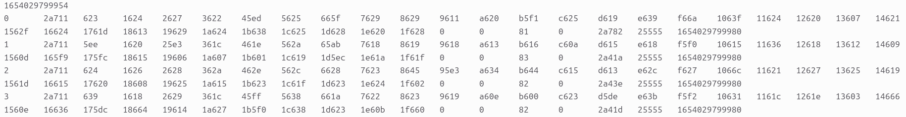
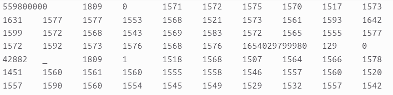
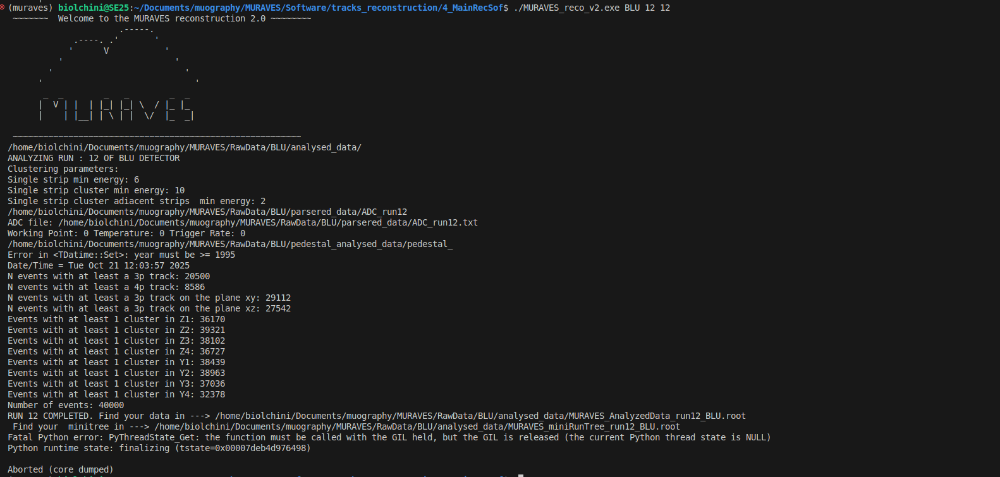

Most recent dicussed topics can be found in the minutes of:

- MURAVES Indico Agenda, [here](https://agenda.infn.it/category/730/)


Starterkit
===
:blue_book: *Standardizing software is essential for reproducible analyses. Containers make this possible. The following section explains how to set up your workspace to run Muraves scripts.*\
**Maintainer:** Alice Biolchini(alice.biolchini@uclouvain.be), please report any problem you may found.

### Step-by-step: set your workspace (locally or on T2B)
1. Connect to T2B (computing cluster of VUB)
2. Download last version of `setup_muraves.sh` by doing `wget https://raw.githubusercontent.com/muraves/Software/refs/heads/master/environment/docker/setup_muraves.sh`. (Please make sure that this is actually the last release of the Git repository, by teking the URL of the last release in [this](https://github.com/muraves/Software/releases) page. The correct URL can also be taken by opening the RAW file in the browser.)
3. Make it executable `chmod +x setup_muraves.sh`
4. Execute: `./setup_muraves.sh`. It will ask for the folder where you want/have your git repository to be. By default is your home directory. 
5. If succeded, congratulations! The container is installed and running.

Several softwares like ROOT, PYTHON, SNAKEMAKE ... are available. Python comes with several fundamental packages like numpy, pandas, matplotlib, scipy, zfit and uproot. You can try to run exaple scripts to fimiliarise with the container.

### Editor: Visual Studio Code
The choice of the editor is personal, read scripts with your favourite editor. However, it can be handy to ssh to T2B directly from your editor and open the scripts as if you were working on your local laptop. For this reason VSCode comes handy. On VSCode it's available an estension called Remote-SSH provided by Microsoft that allows you to tunnel directly to T2B.


### Run Jupyter notebooks (.ipynb files)
Unfortunately, to be able to run jupiter notebooks within the environment requires a couple of steps more:
1. Activate a connection from inside the container by typing: `jupyter notebook --no-browser --ip=0.0.0.0 --port=8888`. This will keep running to maintain the connection. 
2. Among the output you should read an URL, something like: `http://127.0.0.1:8888/tree?token=6324779336imafakeurljusttoshowyou72`.
3. At this point you have two choises:
4. (a) Copy and paste the URL you get on your favourite browser and execute the notebook from there.
4. (b) Alternatively, if you wish to use VSCode, follow these steps:
 - Open the notebook
 - on the top right click on the kernel
 - Click 'select another kernel'
 - Click 'Existing jupyter Server'
 - Paste here the URL and press enter.
 - Select the kernel among those available in the container (in my case, it was named Python 3 (ipykernel))
 - Now you are able to run the notebook on VSCode, note that the first run may take some time to connect to the kernel, that's normal.

**NB: Using a container it's exactly like using another laptop which has only a few folder in common with T2B:**
  - You can pull and push from Git
  - Changes to scripts are persistent (meaning outside the container)
  BUT:
  - Changes to the software installed in the container (new conda envs, new python packages, new libriaries, etc.) are temporary and exist only during your current session.


From detector to data files: the essential
===
:blue_book: *This section describes a few fundamental concepts necessary to understand the data collected by the MURAVES experiment.*\
**Maintaner:** Alice Biolchini\
**Sources:** Mariaelena's, Samip's PhD Theses, personal communications.

### Coordinate system

*x*: direction traversing the vulcano \
*yz*: detector front view \
*xy*: detector upper view \
*zx*: detector side view 

### Detector composition
The MURAVES experiment is composed by 3 detectors (hodoscopes): ROSSO, BLU and NERO. They are placed in the same contaner on the Vesuvius but looking at different directions.\
Each hodoscope consists of three planes ($P_n$, with $n = 1,2,3$), each composed of two subdetectors, $P_{n,z}$ and $P_{n,y}$. The $P_{n,z}$ subdetector is made of 64 plastic scintillator bars oriented along the $z$ direction. Analogously, $P_{n,y}$ consists of 64 plastic scintillator bars oriented along the $y$ direction. Each set of 32 scintillating bars is connected to a readout board, with the remaining 32 bars connected to a second board, for a total of four boards per plane $P_n$.

### Trigger
And among 3 planes of an hodoscope and signal must be above 6 photoelectrons ([FAQ](#why-6-photoelectrons-is-the-threshold-of-the-trigger)): 

$$ P1 \land P2 \land P3 \land signal > 6~phe$$

In particular when refering to a plane: $P1(2,3)$ the trigger is set on the logic OR among the 64 scintillating bars composing a plane:

$$ (P1z~ \cup ~P1y) \cap~ (P2z~ \cup ~P2y) \cap~ (P3z~ \cup ~P3y)$$

### Runs
The definition of the run changes depending on the type of run:
- **Pedestal**: $50\,000$ random trigger events.
No coincidences are required among the planes. This run gives a picture of the Front End electronic. Everything that arrives from the data acquisition system is registered. 
    - *Objective:* Calibration ADC counts to photoelectrons
- **Cosmic**: $40\,000$ trigger events. The trigger applied is that described above ([Trigger](#trigger)).

:warning: **It is important to note that runs from each hodoscope are independent, meaning that there is no temporal relationship between runs from different hodoscopes.**

### Data taking
During the data taking the orientation of the hodoscopes changed. Unfortunately their position as a function of the run (time) hasn't been recorded on-line, but transmitted by communication. The orientation as a function of the run is now hardcoded in `muraves_lib`, the library for Muraves data analysis, specifically [here](https://github.com/muraves/Software/blob/7888b1807fe79720eed6a4c292f63895b2f70ce2/muraves_lib/run_manager.py#L12). 

During data taking a few more files are produced for each run.
- `SLOWCONTROL_run#.gz`
- `CONTEGGI_run#.gz`
- `LOG_run#.gz`

**SLOWCONTROL** : This files contains numers separated by an empty space and this is what they represent:\
[0] $N_{run} - 1$, [1]  timestamp, [2] not important, [3] measured temperature, [4] humidity (%), [5] set temperature (working point WP), [6-21] (16 numbers) DAC10, [22-37] HV, [38-42] MUX, [43] trigger rate, [44] accidental rate, [45-61] OR32. 
Some of these information are important for run monitoring and they are extracted from this file using this function of *muraves_lib*: [parse_slow_control](https://github.com/muraves/Software/blob/7888b1807fe79720eed6a4c292f63895b2f70ce2/muraves_lib/file_handler.py#L87).\
:warning: The fact that inside the file the number of the run is shifted of 1 can be ignored, the reference run is in the filename.

**CONTEGGI** : This means "counts". It's a file made by 16 lines (1 line per each board). Each line has 36 values separated by an empty space.

line 1: [0] $N_{board}$, [1-32] counts of each channel of the board, [33] OR32, [34] DAC10, [35] timestamp\
line 2: ...\
line n: ...\
line 16: ...\

**LOG** : this is a talkative file and has informations already presents in the previous mentioned files.


From *raw* to *parsered* data 
=====
:construction: **Documentation under contruction** \
:blue_book: *This section describes the steps that goes from the raw data to the human readable data format, called "parsered data".*

### Raw data
- **Extention:** Raw data are available as compressed files (`*.gz`). Although it is compressed, each of the `.gz` files contains just one file.
- **Format:** Row data are in exadecimal format. Furthermore, an event is broaded on 16 rows (one per each readout borad). An example of how raw data looks like is shown here:



- **Path**: The path should contain the name of the hodoscope (NERO, BLU, ROSSO)
- **Filename**: ``<ped/slave>Data_evts#_run#_sr#``\
  - ``pedData`` stands for pedestal dataset ([pedestal-run](#runs))
  - ``slaveData`` stands for cosmic dataset ([cosmic-run](#runs)). The name slave derive by the fact that the SiPMTs are connected to 16 slaves readout boards.
  - `evts`: total number of events, so either $40\,000$ (slave) or $50\,000$ (pedestal).
  - `run`: run number.
  - `sr`: subrun. Each subrun containes 10000 events.

- :warning: For each run number there are several subruns. Therefore the total number of events expected for an entire run is divided among several files (4 for slave data and 5 for pedestal).
- Raw data need to undergo a procedure that makes the file easier to handle: parsing procedure, described below.

### Parsing the data
A **parser** function converts the information of the raw data. In particular the exadecimal number are converted in decimal and the information of an event is collected under just one raw.  After the parsing procedure a ``slaveData``(``pedData``)file should have $40\,000$($50\,000$) rows each fully describing a single event: board number, temperature time stamp, and 32 ADC values of each slave board. \

The parsing procedure for 1 single run, *e.g.* `slaveData_evts40000_run12345_sr*.gz`, reads as it follows:
- Extract all the subruns available from their `.gz` extension. The files extracted doesn't have any extension anymore.
- The parser script ``tracks_reconstruction/1_Parser``, can be lunched as it follow:
  ```
  python evtParserGP_<color>.py <raw_data_file> <output_filename> <events_number> <rows_to_combine>
  ```
  - ``<raw_data_file>``: absolute path of the raw data
  - ``<output_filename>``: name of the output. It should be: `ADC_run#.txt`
  - ``<events_number>``: number of events in the file, usually $10\,000$ for a slave data. This is the number of events in a single subrun.
  - ``<rows_to_combine>``: The raw dataset has informations coming from all the 16 slave boards that needs to be combined, therefore i put 16. 
 
- In this example the bash line would be:
  ```
  python evtParserGP_<color>.py  slaveData_evts40000_run12345_sr1  ADC_run12345.txt  10000  16
  ```
- This script will create the outputfile ADC_run12345.txt and fill it with the first $10\,000$ events.
- In orther to parse the other subruns, one should run the same line changing only the number of the rubrun:
  ```
  python evtParserGP_<color>.py  slaveData_evts40000_run12345_sr2  ADC_run12345.txt  10000  16
  ```
  ```
  python evtParserGP_<color>.py  slaveData_evts40000_run12345_sr3  ADC_run12345.txt  10000  16
  ```
  ```
  python evtParserGP_<color>.py  slaveData_evts40000_run12345_sr4  ADC_run12345.txt  10000  16
  ```
- After the first time, where the file ``ADC_run12345.txt`` is generated, the following time is just opened and the new raws appended.
- Once the parsing procedure is applied to all the subrun, the output files containes the information about the $40\,000$ events of a slave dataset.


An example of how parsed data looks like is shown here:


Reconstruction workflow
===
:construction: **Documentation under contruction** \
### Pre-reconstruction
The pre-reconstruction can be run launching `2_PreRec/script_Preanalysis` as it follows:
```
python script_Preanalysis.py <start_run> <end_run>
```
- check that you gave the correct path where to search for the parsered file modifying the variable: `parseredPATH` inside the script.
- `2_PreRec/script_Preanalysis` will call `MakePedestalTree.py`
- <span style="color:green"> Runs without errors, the tree in the root file is filled.</span>
- <span style="color:yellow">**To be understood:**  The output from the available pre-reconstruction script has less branches as what is suppose to have.</span>

<span style="color:yellow">**NB:** </span> The number of board was set to 12, why?  I brought it to 16.

### Pedestal analysis
Pedestal analysis can be run by using two scripts that do the same thing: computes the value on 1phe.
- `OnePhe_evaluator.cpp`
  - Generate a configuration file for each board. Each of the script has 31 channel values and their corrispondend pedestal and 1phe values.
  - Genetare a root file with SLOWCONTROL information  such as temperature, WorkingPOint, TriggerRate, ..., and the values of pedestal and 1phe for each board.
  - Generate a root file with canvas having all the ADC histogram. They are grouped by board.
- `OnePhe_evaluator.py`
  - Generate a configuration file for each board. Each of the script has 31 channel values and their corrispondend pedestal and 1phe values.
  
#### Using `OnePhe_evaluator.cpp`
-   Generate executable by running: 
``` bash
g++ -std=c++20 OnePhe_evaluator.cpp -o OnePhe_evaluator.exe     $(root-config --cflags --libs) -lSpectrum     -I/home/biolchini/miniforge3/envs/muraves/include/python3.11     -L/home/biolchini/miniforge3/envs/muraves/lib -lpython3.11
```
-   To run the pedestal analysis script one should run the following:
``` bash
bash MURAVES_PedestalAnalysis.sh <color> <start_run> <end_run>
```
In my case I had to do a few modification in order to be able to run the script locally:
-   Changed path of `PED_File_name` to my local path
-   Changed `Pedestal_File` to my local path to the PreAnalysed root file
-   :warning: Found internal **unconsistency** of the name of the tree of the PreAnalysed data: PreAnalysis saves it as `ped_tree`, the script searches as `PEDtree`.
-   :warning: **Suboptimal for debugging** the name of the tree is repeated several time instead of defining a variable.


#### Using `OnePhe_evaluator.py`
- Run the following command:
  ``` bash
  python OnePhE_evaluator.py <color> <number_of_runs> <delta_around_central_runID> <central_runID>
  ```
  *e.g.* running the pedestal analysis for one run only of the ROSSO hodoscope
  ``` bash
  python OnePhE_evaluator.py ROSSO 1 0 15012
  ```

### Main Reconstruction: `MURAVES_reco_v2.cpp`.
In order to run the main reconstruction run the following command to compile the `.cpp` and create the executable:
```
g++ -std=c++20 ClusterLists.cc EvaluateAngularCoordinates.cc ReadEvent.cc Tracking.cc MURAVES_reco_v2.cpp -o MURAVES_reco_v2.exe     $(root-config --cflags --libs) -lSpectrum     -I/home/biolchini/miniforge3/envs/muraves/include/python3.11     -L/home/biolchini/miniforge3/envs/muraves/lib -lpython3.11

```
Once the executable `MURAVES_reco_v2.exe` is created it is possible to run:
```
./MURAVES_reco_v2.exe <color> <start_run> <end_run>
```
or the bash script `MURAVESanalysis.sh`.
If the script runs properly the following should be seen on the terminal:


**NB**: The error is due to a pythonic part that computes the run time. It doesn't affect the execution of the main task of the script.
#### Outputs
The outputs are two root files.
- `MURAVES_miniRunTree_run12_BLU.root`
- `MURAVES_AnalyzedData_run12_BLU.root`

#### Side notes:
A few parameters are harcoded in the script directly:
-   **Spacial resolution values** 
-   **Detector positions** 
-   **Hardware information** (number of boards, `nInfo`, `nChInfo`, ...)
-   **Filepaths**
A better way to approach this is to create a configuration file with all these parameters.
This approach minimises the interations and the changes to the main reconstruction script. 
In particular this is very important to have a flexible reconstruction script that can run from every path specifed.


### Golden selection

# FAQ

### Why 6 photoelectrons is the threshold of the trigger?
Studies have been performed demonstrating that this is a good trade off between dark counts (noise) and signal. :warning: <span style="color:yellow"> Documentation unavailable</span>

# Question to be answered

### What's "spiroc hybrid map"?
In the main reconstruction script a file called `"../../ANALYSIS/ReconstructionTracks_from3to4/config/spiroc-hybrid-map.cfg"` is required. What's this needed for, what's in it?

### Telescope configuration file 
This file is used, what's in it? There were some values, related to the telescope, hardcoded in the script. 
`/home/muraves/Desktop/MURAVES/ANALYSIS/ReconstructionTracks_from3to4/config/telescope`

### Data quality monitoring
:warning: <span style="color:red"> Nothing is implemented in this regard at the moment.</span>

- **To Do**: 
  - Create a set of rules to accept or not runs. At the moment good and bad runs are all together.
  - The trigger rate is a goot test to select and discard bad runs.
