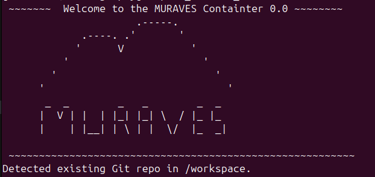

:construction: <span style="color:yellow">**Documentation under contruction** </span>

MURAVES data analysis
========================

# Muraves environment - Docker

The `muraves-env` docker image is used to perform the analysis of MuRaVes data.
I updated the repository. Now you can follow these steps to activate the muraves container, from there you can use muraves_lib and the scripts that I sent you

I updated the repository. Now you can follow these steps to activate the muraves container, from there you can use muraves_lib and the scripts that I sent you

### Step-by-step

1. Connect to T2B
2. Download last version of setup_muraves.sh by doing `wget https://raw.githubusercontent.com/muraves/Software/refs/heads/master/environment/docker/setup_muraves.sh`
3. Make it executable `chmod +x setup_muraves.sh`
4. Execute: `./setup_muraves.sh`. It will ask for the folder where you want/have your git repository to be. By default is your home directory. 
5. If succeded, congratulations! The container is installed and running.
6. Type `conda activate muraves` to enter the conda environment, where softwares like ROOT, PYTHON, SNAKEMAKE ... are available.

### Editor: Visual Studio Code
The choice of the editor is personal, read scripts with your favourite editor. However, it can be handy to ssh to T2B directly from your editor and open the scripts as if you were working on your local laptop. For this reason VSCode comes handy. On VSCode it's available an estension called Remote-SSH provided by Microsoft that allows you to tunnel directly to T2B.


### Run Jupyter notebooks (.ipynb files)
1. To be able to run jupyter notebooks activate a connection from inside the container by typing: `jupyter notebook --no-browser --ip=0.0.0.0 --port=8888`. This will keep running to maintain the connection. 
2. Among the output you should read an URL like: `http://127.0.0.1:8888/tree?token=6324779336ad8ec1c039f80218f0128fa5a86ff6c8abda72`.
9a. You can copy and paste this URL on your favourite browser and execute the notebook from there.
9b. Alternatively, if you wish to use VSCode, follow these steps:
 - Open the notebook
 - on the top right click on the kernel
 - Click 'select another kernel'
 - Click 'Existing jupyter Server'
 - Paste here the URL and press enter.
 - Select the kernel among those available in the container (in my case, it was named Python 3 (ipykernel))
 - Now you are able to run the notebook on VSCode, note that the first run may take some time to connect to the kernel, that's normal.

**NB: Using a container it's exactly like using another laptop which has only a few folder in common with T2B:**
  - You can pull and push from Git
  - Changes to scripts are persistent (meaning outside the container)
  BUT:
  - Changes to the software installed in the container (new conda envs, new python packages, new libriaries, etc.) are temporary and exist only during your current session.


## Use the container on T2B

*The image has been already built. So this isn't really an installation, rather instructions on how to run the container from T2B.*

The image of the container is available on T2B as `.sif` image (Docker isn't available on T2B, 'singularity' has been used). To run the image the user has to login into T2B, go to `/group/Muography` and run the command:
```
./run_muraves_env.sh
```
This is an executable that will automathically:
- Run the image `/group/Muography/container/muraves-env.sif`
- Activate the muraves mamba environment with ROOT, python3 and other usefull packages.
- Return a welcome message
- Check that in the workspace there is a git reposotory. 
- **important**: The workspace is set to be the MuRaVes Git repository on T2B located in `/group/Muography/Software/`. This is a read-only folder with the only objective to run stable release of the MuRaVes software. This means you cannot modify or create new script here. If the use wish to use the container for developing purposes it is of course possible [Check this instructions](#container-in-developing-mode)!

The container is up and running is you see this output:



### Container in developing mode 
The user can use this container mounting any other folder. This means that they can have any other folder available inside the container. The path can be changed by modifing the variable `WORKSPACE_HOST="/group/Muography/<whatever/folder>"` in the `/group/Muography/run_muraves_env.sh` file.

**The container is ready to be used in developing mode: all the changes on the scripts or more in general in the workspace will persist after the logout.**

## Local installation
*For the local execution of MuRaVes script, the user is free to set up the preferred environment. One possibility is to use the container available in this Git repository: in the `/environment/docker/` folder are available the Dockerfile and a bash script `entrypoint.sh` that are needed to build the image of the container.*

The following steps leads to the installation of the container.
- I don't have a MuRaVes Git repository -> [Steps](#i-do-not-have-a-muraves-repo-yet)

- I have already a the MuRaVes Git repository cloned on my laptop -> [Steps](#i-have-a-muraves-repo).

### I do not have a MuRaVes repo yet
1. Clone the entire repository locally using `git clone`:
   ```bash
   git clone https://github.com/muraves/Software.git 
   ```
2. Enter the folder where the docker file is located `~$ cd Software/environment/docker/`, and run:
   ```bash
   docker build -t muraves-env .
   ```
3. Now you can run the image and choose the working directory, for instance:
   ```bash
   docker run -it -v <~/my/local/folder>/Software:/workspace muraves-env
   ```
   By giving the path `<~/my/local/folder>/Software` before `:/workspace`, it means that all the script locally available inside this folder will be available also in the container. **The changes that the user applies while working in the container will persists once the container il closed.**
4. The user is now ready to go: develop or run scripts.

### I have a MuRaVes repo
1. Pull last changes from Git by running `git pull` from the `Software` directory.
2. Enter the folder where the docker file is located `~$ cd Software/environment/docker/`, and run:
   ```bash
   docker build -t muraves-env .
   ```
2. Now you can run the image and choose the working directory, for instance:
   ```bash
   docker run -it -v <~/my/local/folder>/Software:/workspace muraves-env
   ```
   By giving the path `<~/my/local/folder>/Software` before `:/workspace`, it means that all the script locally available inside this folder will be available also in the container. **The changes that the user applies while working in the container will persists once the container il closed.**
3. The user is now ready to go: develop or run scripts.


# Container installation - for mainteiners
T2B do not support docker. Therefore a few step are necessary in order to bring the container there.
- Apply of the changes to the dockerfile locally.
- Build the image locally as explained [here](#i-have-a-muraves-repo)
- Save the image that you created as `.tar` file
  ```bash
  docker save muraves-env:latest -o muraves-env.tar
  ```
- Copy the tar file on T2B. Better using rsync as it is a file of ~6GB:
  ```bash
  rsync -avP /home/biolchini/Documents/muography/MURAVES/Software/environment/docker/muraves-env.tar  abiolchi@mlong.iihe.ac.be:/group/Muography/container/.
  ```
  Remember to substituting the path and the username.
- Login to T2B and build the image using 'singularity':
  ```bash
  singularity build muraves-env.sif docker-archive://muraves-env.tar
  ```
- From here, if I run the image using `singularity shell --bind <my/folder>:/workspace muraves-env.sif`, the bash file called `entrypoint.sh` will not be runned, therefore the mamba environment will not be automatically activated. 
- To simplyfy user's life I wrote a wrapper `run_muraves_env.sh` that run the image and call `entrypoint.sh`.
- To conclude make the wrapper an executable by running
  ```bash
  chmod +x run_muraves_env.sh
  ```
- Now run
    ```bash
     ./run_muraves_env/sh
    ```
  The container and the environment are running

# Access and modify scripts easily - VSCode


# Muraves environment - Mamba
*The `muraves` package is used to perform the analysis of muraves data.*
## Install

Install Miniforge as explained here https://github.com/conda-forge/miniforge. \
(*This documentation shows Miniforge, but you could choose Anaconda or Miniconda instead (Go to section [Install Miniconda](https://gitlab.cern.ch/LHCb-RD/ewp-bd2ksteeangular-legacy/-/tree/master/b2kstll?ref_type=heads#install-miniconda3). Miniforge has the advantage to have mamba as well which is faster than conda.*)

* Choose what to download based on you OS. For Ubuntu/Linux: download this [Miniforge3-Linux-x86_64.sh](https://github.com/conda-forge/miniforge/releases/latest/download/Miniforge3-Linux-x86_64.sh)
* Execute the file `bash Miniforge3-Linux-x86_64.sh`
* Follow the instructions for installation
* Once miniforge is installed, it will ask a question concerning its activation. Answer yes, this way you can use mamba directly.
* Once installed, remember close and open again the termial or to source the bashrc file. In this way the modification will be effective.


## Create environment

Nominally, use the following method to install the package:\
    (*This exaple use `mamba` which works with Miniforge. If you use Anaconda or Miniconda you can use the same command replacing `mamba` with `conda`.*)

``` bash
mamba create -n muraves python=3.11 iminuit root uv -c conda-forge
``` 

This will create an enviroment called **muraves**. In order to activate it, do :

```bash
mamba activate muraves
```
Once inside the enviroment, you can clone muraves GitHub repository, if not done already.

:construction: <span style="color:yellow">**Work in progress** </span>
The necessary packages to run muraves reconstruction and analysis are still to be fully defined. For the moment this environment only has the essetials: root, python and minuit for basic minimisations.


# Troubleshooting

## Error importing zfit

If the error looks like `ImportError: /lib64/libstdc++.so.6: version `GLIBCXX_3.4.20' not found`, you can solve the problem by giving the correct path to the file. Follow the steps:
* Check if the file ` libstdc++.so.6` is in your mamba environment: 

```bash
    ls <mypath>/miniforge3/envs/muraves/lib/
```
* If the file is there just type:

```bash
    export LD_LIBRARY_PATH=<mypath>/miniforge3/envs/muraves/lib/:$LD_LIBRARY_PATH
```

This command can go in the `~.bashrc` as well. In this was it is automatically called everytime a new terminal is called.

* If the file is not there, you can seach where it is and give the correct path to it.

# Install Miniconda3

In order to install miniconda3, run this:

```bash
    curl -o ./install_miniconda3.sh https://repo.anaconda.com/miniconda/Miniconda3-latest-Linux-x86_64.sh
    bash install_miniconda3.sh
```
when prompted, select the path where you want to install it. It's not a good idea to install that in your home folder, but rather in a place not too limited by space. 

ATTENTION : Do not add the default ``conda initialize`` commands to your .bashrc.

Instead, add this to your .bashrc :

```bash
    source /path/to/your/miniconda3/etc/profile.d/conda.sh
    export CONDA_BASE=$(conda info --base)
```
Now you should be able to create and activate an environment.

Compatibility
-------------

Licence
-------

Authors
-------

The file was written by the [Alice Biolchini](mailto:alice.biolchini@uclouvain.be).
